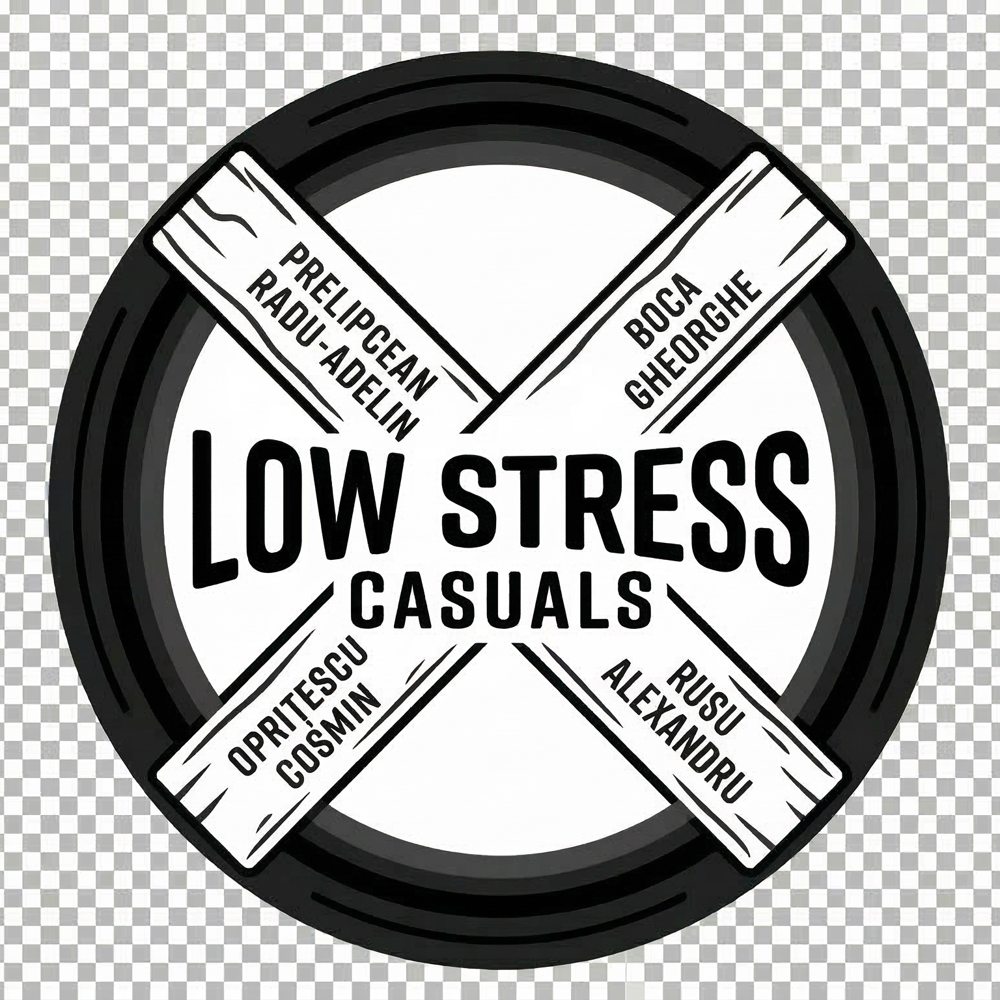

# 
    Team Low Stress Casuals - H&S 2026 

## Sistem de Monitorizare IoT cu ESP32-C3 Super Mini

Acest proiect reprezintă soluția pentru Task 1 din cadrul preselecțiilor Hard&Soft 2026. Sistemul monitorizează parametri de mediu și de sistem în timp real, oferind feedback vizual pe OLED, Web și Mobile.

### 🛠️ Hardware Stack
- **MCU:** ESP32-C3 (PlatformIO Framework)
- **Power Monitoring:** INA219 (Tensiune, Curent, Baterie)
- **Sensors:** HW-111 (RTC pentru Timestamp), HW-011 (AD/DA pentru Temp/Lumină)
- **Display:** OLED 0.96" I2C
- **Navigation:** 2x Tactile Switches

### 📊 Funcționalități Principale
- **Real-time Logging:** Eșantionare la 1s cu timestamp precis via RTC.
- **Sistem de Gestiune Energie:** Monitorizarea consumului și estimarea duratei de viață a bateriei 18650.
- **Multi-platform Display:** Date afișate numeric și grafic pe Web, Mobile și Display local.
- **System Health:** Monitorizare CPU-load și nivel semnal RSSI.

### 💻 Instalare și Rulare
1. **Firmware:** Deschide folderul `/firmware` în VS Code cu extensia PlatformIO și apasă `Upload`.
2. **Web:** `cd web-dashboard && npm install && npm start`.
3. **Mobile:** (Instrucțiuni specifice pentru framework-ul ales).

### 📖 Documentație
Raportul tehnic detaliat, inclusiv elementele de calcul pentru CPU-load și durata bateriei, se găsește în folderul `/docs`.
